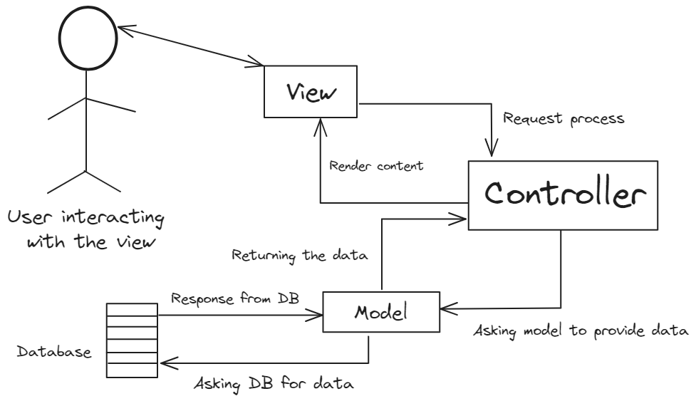

# MVC Design-Pattern in der Anwendungen

- MVC steht für Model-View-Controller und ist ein Architektur-Pattern / Design-Pattern, das in Anwendungen verwendet wird, um den Code sauber, strukturiert und leichter wartbar zu machen.

### Das Konzept hinter MVC

- MVC trennt eine Anwendung in drei Hauptkomponenten:

1. Model (Datenlogik)

- Enthält die Geschäftslogik der Anwendung.
  Verantwortlich für das Abrufen, Speichern und Verarbeiten von Daten aus der Datenbank.

2. View (Präsentationsebene)

- Zeigt die Daten aus dem Model an.
  Enthält HTML, CSS und manchmal einfache Skripte zur Darstellung.
  Controller (Steuerungsebene)

3. Controller ist Vermittler zwischen Model und View.

- Nimmt Benutzereingaben entgegen, ruft die entsprechenden Model-Methoden auf und gibt die Daten an die View weiter.

## 1. Beispiel Projektstruktur in PHP-Anwendung

```
/mvc-app
 ├── index.php
 ├── controllers/
 │   ├── UserController.php
 ├── models/
 │   ├── User.php
 ├── views/
 │   ├── users.php
 ├── config/
 │   ├── database.php
```

---

## 2. Model – `models/User.php`

```php
class User {
    private $db;

    public function __construct($db) {
        $this->db = $db;
    }

    public function getUsers() {
        $query = $this->db->query("SELECT * FROM users");
        return $query->fetchAll(PDO::FETCH_ASSOC);
    }
}
```

---

## 3. Controller – `controllers/UserController.php`

```php
require_once 'models/User.php';
require_once 'config/database.php';

class UserController {
    private $userModel;

    public function __construct() {
        $this->userModel = new User($db);
    }

    public function index() {
        $users = $this->userModel->getUsers();
        require 'views/users.php';
    }
}
```

---

## 4. View – `views/users.php`

```php
<!DOCTYPE html>
<html>
<head><title>User List</title></head>
<body>
    <h2>User List</h2>
    <ul>
        <?php foreach ($users as $user): ?>
            <li><?= htmlspecialchars($user['name']) ?></li>
        <?php endforeach; ?>
    </ul>
</body>
</html>
```

---

## 5. Hauptdatei – `index.php`

```php
require_once 'controllers/UserController.php';

$controller = new UserController();
$controller->index();
```

---

## 6. Datenbankverbindung – `config/database.php`

```php
$dsn = 'mysql:host=localhost;dbname=mydatabase;charset=utf8';
$username = 'root';
$password = '';

try {
    $db = new PDO($dsn, $username, $password);
    $db->setAttribute(PDO::ATTR_ERRMODE, PDO::ERRMODE_EXCEPTION);
} catch (PDOException $e) {
    die("Datenbankverbindungsfehler: " . $e->getMessage());
}
```

---

## Vorteile von MVC

- **Trennung von Logik und Darstellung** → Bessere Wartbarkeit
- **Wiederverwendbare Komponenten** → Views und Models können wiederverwendet werden
- **Bessere Code-Organisation** → Code ist sauberer und verständlicher
- **Leichtere Zusammenarbeit** → Entwickler können sich auf einzelne Teile konzentrieren

---

Dieses MVC-System stellt eine grundlegende Implementierung dar. Es kann durch Routing, Middleware und weitere Features erweitert werden.

---


---

### Tag 2 ( Virtual-Host )

- Ein Virtual Host (Virtueller Host) in Apache erlaubt es, mehrere Websites oder Projekte auf einem einzigen Server zu hosten und ihnen individuelle Domains oder Subdomains zuzuweisen. Statt localhost/projektname/public zu verwenden, kannst du mit einem Virtual Host beispielsweise projekt.local oder mvc.local aufrufen.

---
### Konzept hinter Virtual Hosts:
#### 1. Bessere Struktur für Projekte 
- Ohne Virtual Hosts sieht es so aus:  localhost/mvc/public
- Mit Virtual Hosts: mvc.local

#### 2. Erleichterung der Entwicklung
- Statt umständliche Pfade mit /public zu verwenden, kannst du die URL direkt nutzen. Und es Erlaubt eine realistischere Umgebung, ähnlich einer echten Domain.

#### 3.Unabhängige Konfiguration für Projekte
- Jedes Projekt kann eigene Apache- und PHP-Einstellungen haben. Und somit jedes Projekt eigene Error Logs, eigene SSL-Zertifikate für HTTPS-Testing.


#### 4. Vermeidung von Konflikten mit .htaccess
- In vielen Frameworks (z. B. Laravel, Symfony, MVC-Strukturen) erwartet die .htaccess, dass der public-Ordner der Einstiegspunkt ist. Und Ohne Virtual Hosts müsstest du /public immer manuell angeben.

---
# Virtual Host in XAMPP einrichten (Windows)

## 1️⃣ Apache Virtual Host Datei bearbeiten

Öffne die Datei `httpd-vhosts.conf` in XAMPP. Der Standardpfad ist:

📂 **Windows (XAMPP)**
```
C:\xampp\apache\conf\extra\httpd-vhosts.conf
```

Füge folgenden Code am Ende der Datei hinzu:

```apache
<VirtualHost *:80>
    DocumentRoot "C:/xampp/htdocs/mvc/public"
    ServerName mvc.local
    ErrorLog "C:/xampp/apache/logs/mvc.local-error.log"
    CustomLog "C:/xampp/apache/logs/mvc.local-access.log" common
    <Directory "C:/xampp/htdocs/mvc/public">
        AllowOverride All
        Require all granted
    </Directory>
</VirtualHost>

<!-- Hinweis wenn vor ihnen ## steht dann mussen wir sie weglöschen damit virtuale-host active werden. -->
```

🚀 **Was passiert hier?**
- `DocumentRoot` gibt an, wo sich das Projekt befindet.
- `ServerName` gibt den Namen an, unter dem das Projekt erreichbar wird.
- `AllowOverride All` erlaubt `.htaccess`-Regeln.
- `"ErrorLog "C:/xampp/apache/logs/mvc.local-error.log"` , Speichert alle Fehler, die während des Betriebs deiner Website auftreten, in der Datei mvc-error.log.
- `"CustomLog "C:/xampp/apache/logs/mvc.local-access.log" common` Speichert alle Anfragen an deinen Virtual Host in der Datei `mvc.local-access.log` und enthält Informationen zu jeder Anfrage, wie IP-Adresse des Clients, Zeitpunkt, HTTP-Statuscode und angeforderte Ressourcen.

---

## 2️⃣ Host-Datei bearbeiten

Da `mvc.local` keine echte Domain ist, muss sie lokal in die Hosts-Datei eingetragen werden.

📂 **Windows (Notepad als Admin öffnen)**
```
C:\Windows\System32\drivers\etc\hosts
```

➡ **Füge am Ende der Datei hinzu:**

```
127.0.0.1   mvc.local
```

---

## 3️⃣ Apache neu starten

Damit die Änderungen greifen, muss der Apache-Server neugestartet werden:

➡ **XAMPP Control Panel öffnen** → **Apache neu starten**
 
 ---

- Für mehrere Projekte müssen wir für jedes Projekt eigene virtual-host wie folgende bespiele erstellen.

```apache
<!-- Das ist für MVC Projekt. -->
<VirtualHost *:80>
    DocumentRoot "C:/xampp/htdocs/mvc/public"
    ServerName mvc.local
    ErrorLog "logs/dummy-host2.example.com-error.log"
    CustomLog "logs/dummy-host2.example.com-access.log" common
    <Directory "C:/xampp/htdocs/mvc/public">
        AllowOverride All
        Require all granted
    </Directory>
</VirtualHost>

<!-- Und das ist für blog Projekt. -->
<VirtualHost *:80>
    DocumentRoot "C:/xampp/htdocs/blog/public"
    ServerName blog.local
    ErrorLog "logs/dummy-host2.example.com-error.log"
    CustomLog "logs/dummy-host2.example.com-access.log" common
    <Directory "C:/xampp/htdocs/blog/public">
        AllowOverride All
        Require all granted
    </Directory>
</VirtualHost>

```


